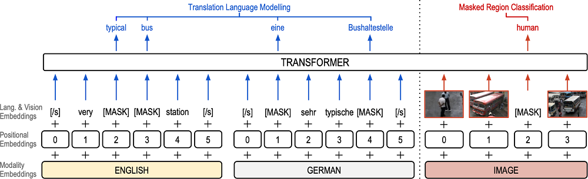

<!--
# Experiment with VTLM using English and Portuguese languages

Experiment related to research scholarship.

The original data were replaced so that the model could work with the Portuguese language as well.

#### VTLM architecture:

Pre-trained language models have been shown to substantially improve performance in many natural language tasks. 
Although the early focus of such models was single language pre-training, recent advances have resulted in cross-lingual and 
visual pre-training methods. In this paper, the authors combined these two approaches to learn visually-grounded cross-lingual representations. 
Specifically, they extended the [translation language modelling](https://github.com/facebookresearch/XLM) (Lample and Conneau, 2019) with masked 
region classification, and performed pre-training with three-way parallel vision & language corpora. They showed that when fine-tuned for multimodal machine 
translation, these models obtained state-of-the-art performance. They also provided qualitative insights into the usefulness of the learned grounded representations.

[Read the paper (EACL 2021)](https://arxiv.org/pdf/2101.10044.pdf)

## About the Codebase
- The codebase is a extended version of [VTLM](https://github.com/ImperialNLP/VTLM).
- I extended the Multi30k (Elliott et al., 2016) dataset with Portuguese translations. 
The translation of English captions into Portuguese was automatically performed using Google Translate API. 
- Byte pair encoding technique was used to learn a joint 50k BPE model on the CC dataset with Portuguese translations.
- All models were trained on a single GPU.
-->
# Experimento com VTLM usando os idiomas inglês e português 

Os dados de entrada originais foram substituídos e algumas mudanças foram realizadas para que o modelo pudesse trabalhar com o idioma português também.

#### Arquitetura:

"Pre-trained language models have been shown to substantially improve performance in many natural language tasks. Although the early focus of such models was single language pre-training, recent advances have resulted in cross-lingual and visual pre-training methods. In this paper, we combine these two approaches to learn visually-grounded cross-lingual representations. Specifically, we extend the translation language modelling (Lample and Conneau, 2019) with masked region classification, and perform pre-training with three-way parallel vision & language corpora. We show that when fine-tuned for multimodal machine translation, these models obtain state-of-the-art performance. We also provide qualitative insights into the usefulness of the learned grounded representations." (CAGLAYAN et al., 2021)

[Read the paper (EACL 2021)](https://arxiv.org/pdf/2101.10044.pdf)
